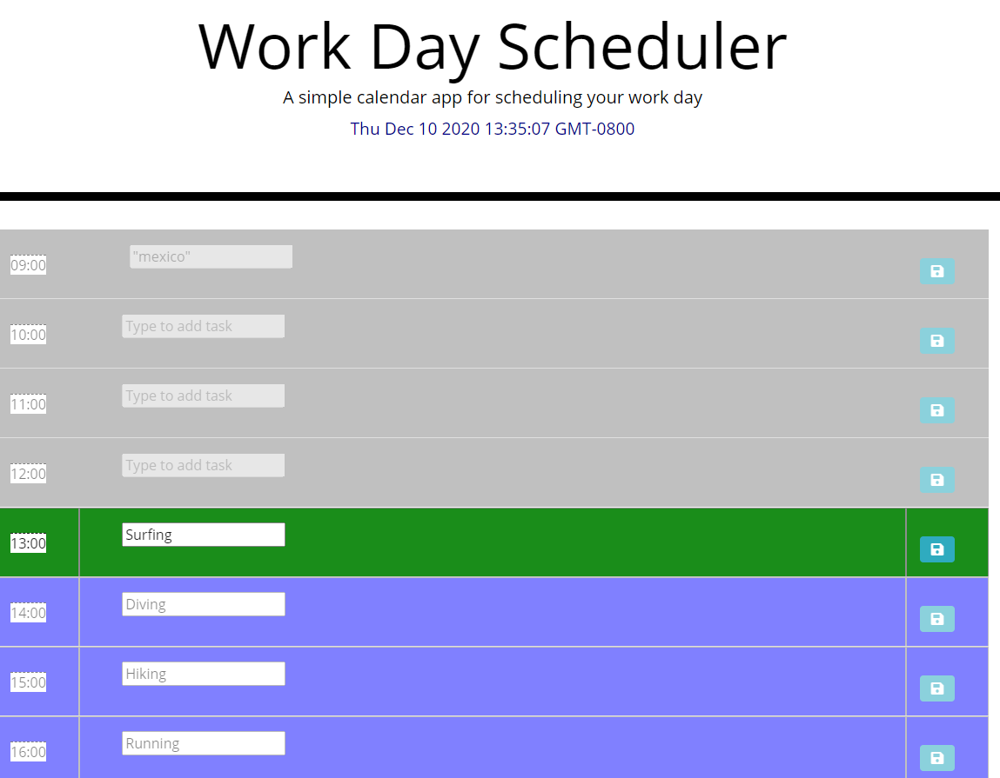
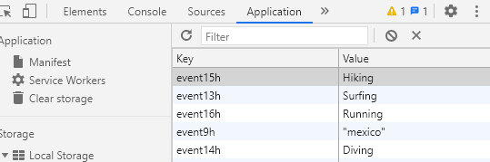

Decription: 
*Workday Scheduler - (I have created a scheduling application using a combination of HTML, CSS/Bootstrap and dynamic JS/JQuery.  The scheduler contains hourly time-blocks for regular work-day hours that are color-coded per past/present/future.  New tasks/events can be typed into input elements.  When the save button is clicked that event will be saved to local storage and persist/display on subsequent page loads within browser.)
*Submission date of 12/10/2020

Screenshots:

Links: 
*GitHub Repository: https://github.com/awoolley1/CalendarApplication
*Live URL: https://awoolley1.github.io/CalendarApplication/

Author: 
*Alex Woolley; https://github.com/awoolley1; alexander.s.woolley@gmail.com